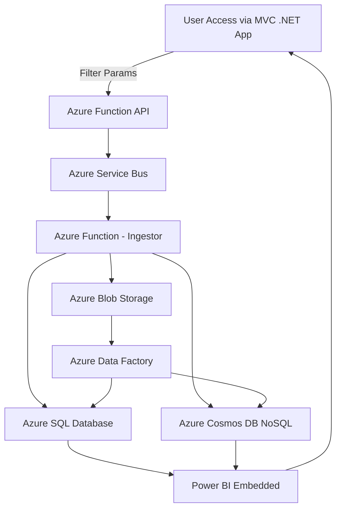

The client is a Business Intelligence, Social Media company in UK. They wanted an extended functionality for their cloud application that can make easy access to reports for its users. Their existing MVC .NET application needed an add-on piece of software that can help the end users in creating the customized reports with filters. To make this possible, client wanted a rich user-friendly interface that can provide accessible of reports quickly and swiftly.

The core challenge meant in reading the 300 million records of large data daily and storing the same for generating reports. To make these reports easily access to the users in order to read and extract them without performance issues, client wanted to use Azure services for storage purposes. Reading the unstructured data and reporting the same from NoSQL database was the another essential challenge in providing a business solution.
Thanks for the detailed scenario! Here’s a comprehensive solution architecture that extends the existing MVC .NET application to support **customized reporting with filters**, scalable to handle **300 million daily records** using **Azure services**, including **SQL**, **NoSQL**, **Azure Service Bus**, and **Azure Storage**.

---

### ✅ **Solution Scenario Summary**

The client needs to:
- Extend their MVC .NET cloud app to let users create **customized, filterable reports**.
- Ingest **300 million records per day** from various data sources.
- Store **structured and unstructured data** efficiently.
- Generate reports **on-demand** with high performance and **no bottlenecks**.
- Provide **role-based access** and **filtering** options on a rich UI.

---

### ✅ **Proposed Azure Architecture Diagram**
Here’s a Mermaid diagram to visualize the architecture:



---

### ✅ **Azure Components Used**

| Component | Purpose |
|----------|---------|
| **Azure SQL Database** | Stores structured, aggregated data for quick access. Ideal for tabular reports. |
| **Azure Cosmos DB (NoSQL)** | Handles unstructured data (e.g., social metadata). Supports fast, scalable reads. |
| **Azure Blob Storage** | Used for storing raw ingested files or logs (e.g., JSON, CSV). Also used as backup source. |
| **Azure Function App** | Stateless APIs for ingestion and querying/filtering/reporting logic. |
| **Azure Service Bus** | Manages ingestion pipeline with decoupling and high throughput. |
| **Power BI Embedded** | Embedded in MVC app for report generation and customization. |
| **Azure Data Factory (Optional)** | ETL to transform data into SQL and Cosmos DB periodically. |

---

### ✅ **Key SQL Tables**

Here are the **Azure SQL DB tables** that support structured reporting.

#### 1. `Users`
```sql
CREATE TABLE Users (
    UserID INT PRIMARY KEY,
    Username NVARCHAR(100),
    Email NVARCHAR(255),
    Role NVARCHAR(50),
    CreatedAt DATETIME
);
```

#### 2. `ReportDefinitions`
```sql
CREATE TABLE ReportDefinitions (
    ReportID INT PRIMARY KEY,
    UserID INT,
    ReportName NVARCHAR(255),
    Filters NVARCHAR(MAX), -- JSON of applied filters
    CreatedAt DATETIME,
    FOREIGN KEY (UserID) REFERENCES Users(UserID)
);
```

#### 3. `ReportData`
```sql
CREATE TABLE ReportData (
    ReportDataID BIGINT PRIMARY KEY,
    ReportID INT,
    RecordDate DATETIME,
    MetricName NVARCHAR(100),
    MetricValue FLOAT,
    SourceType NVARCHAR(50), -- SQL, Blob, Cosmos
    FOREIGN KEY (ReportID) REFERENCES ReportDefinitions(ReportID)
);
```

#### 4. `IngestionLog`
```sql
CREATE TABLE IngestionLog (
    IngestionID BIGINT PRIMARY KEY,
    SourceFile NVARCHAR(500),
    Status NVARCHAR(50),
    RecordsProcessed BIGINT,
    ProcessingTimeSeconds INT,
    Timestamp DATETIME
);
```

---

### ✅ **Azure Cosmos DB Example (NoSQL JSON Format)**

```json
{
  "id": "meta_98765",
  "userId": "123",
  "socialPlatform": "Twitter",
  "postContent": "Exciting new dashboard for our users!",
  "hashtags": ["#BI", "#Reporting"],
  "postedAt": "2025-03-28T08:23:45Z"
}
```

---

### ✅ **Workflow Breakdown**

1. **Data Ingestion**
   - External systems or jobs publish data (JSON/CSV/etc.) to **Azure Blob Storage**.
   - Blob triggers Azure Function to read the file.
   - The Function pushes a message to **Azure Service Bus**.
   - An **Ingestion Function** reads the message, processes the data, and stores:
     - Structured metrics into **Azure SQL**.
     - Metadata and logs into **Cosmos DB**.
     - Raw files into **Blob Storage** for archival.

2. **Custom Report Generation**
   - Users log in to the **MVC App**.
   - UI calls **Azure Function API** with filter parameters.
   - The Function queries **SQL** or **Cosmos DB** as needed.
   - Results are passed back or rendered in **Power BI Embedded**.

3. **Scheduled ETL (Optional)**
   - **Azure Data Factory** can be used to aggregate and transform data daily from Blob/Cosmos to SQL.

---

### ✅ **Performance Considerations**

- Use **partitioning** and **indexes** in SQL and Cosmos DB for fast filter-based queries.
- Use **Azure SQL Hyperscale** for handling large report datasets.
- Archive old data to **Azure Data Lake Gen2** if needed.
- Use **Power BI Aggregations** for report optimization.

---

Would you like me to generate a **Power BI schema**, **API logic**, or the **Terraform/Bicep templates** for provisioning this architecture?
