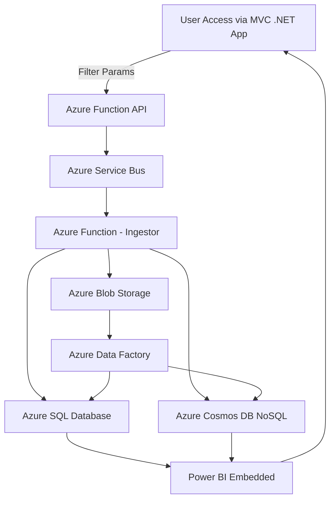

The client is a Business Intelligence, Social Media company in UK. They wanted an extended functionality for their cloud application that can make easy access to reports for its users. Their existing MVC .NET application needed an add-on piece of software that can help the end users in creating the customized reports with filters. To make this possible, client wanted a rich user-friendly interface that can provide accessible of reports quickly and swiftly.

The core challenge meant in reading the 300 million records of large data daily and storing the same for generating reports. To make these reports easily access to the users in order to read and extract them without performance issues, client wanted to use Azure services for storage purposes. Reading the unstructured data and reporting the same from NoSQL database was the another essential challenge in providing a business solution.

Here’s a comprehensive solution architecture that extends the existing MVC .NET application to support **customized reporting with filters**, scalable to handle **300 million daily records** using **Azure services**, including **SQL**, **NoSQL**, **Azure Service Bus**, and **Azure Storage**.

---

### ✅ **Solution Scenario Summary**

The client needs to:
- Extend their MVC .NET cloud app to let users create **customized, filterable reports**.
- Ingest **300 million records per day** from various data sources.
- Store **structured and unstructured data** efficiently.
- Generate reports **on-demand** with high performance and **no bottlenecks**.
- Provide **role-based access** and **filtering** options on a rich UI.

---

### ✅ **Proposed Azure Architecture Diagram**
Here’s a Mermaid diagram to visualize the architecture:



---

### ✅ **Azure Components Used**

| Component | Purpose |
|----------|---------|
| **Azure SQL Database** | Stores structured, aggregated data for quick access. Ideal for tabular reports. |
| **Azure Cosmos DB (NoSQL)** | Handles unstructured data (e.g., social metadata). Supports fast, scalable reads. |
| **Azure Blob Storage** | Used for storing raw ingested files or logs (e.g., JSON, CSV). Also used as backup source. |
| **Azure Function App** | Stateless APIs for ingestion and querying/filtering/reporting logic. |
| **Azure Service Bus** | Manages ingestion pipeline with decoupling and high throughput. |
| **Power BI Embedded** | Embedded in MVC app for report generation and customization. |
| **Azure Data Factory (Optional)** | ETL to transform data into SQL and Cosmos DB periodically. |

---

### ✅ **Key SQL Tables**

Here are the **Azure SQL DB tables** that support structured reporting.

#### 1. `Users`
```sql
CREATE TABLE Users (
    UserID INT PRIMARY KEY,
    Username NVARCHAR(100),
    Email NVARCHAR(255),
    Role NVARCHAR(50),
    CreatedAt DATETIME
);
```

#### 2. `ReportDefinitions`
```sql
CREATE TABLE ReportDefinitions (
    ReportID INT PRIMARY KEY,
    UserID INT,
    ReportName NVARCHAR(255),
    Filters NVARCHAR(MAX), -- JSON of applied filters
    CreatedAt DATETIME,
    FOREIGN KEY (UserID) REFERENCES Users(UserID)
);
```

#### 3. `ReportData`
```sql
CREATE TABLE ReportData (
    ReportDataID BIGINT PRIMARY KEY,
    ReportID INT,
    RecordDate DATETIME,
    MetricName NVARCHAR(100),
    MetricValue FLOAT,
    SourceType NVARCHAR(50), -- SQL, Blob, Cosmos
    FOREIGN KEY (ReportID) REFERENCES ReportDefinitions(ReportID)
);
```

#### 4. `IngestionLog`
```sql
CREATE TABLE IngestionLog (
    IngestionID BIGINT PRIMARY KEY,
    SourceFile NVARCHAR(500),
    Status NVARCHAR(50),
    RecordsProcessed BIGINT,
    ProcessingTimeSeconds INT,
    Timestamp DATETIME
);
```

Following are **SQL stored procedures** for **CRUD operations (Create, Read, Update, Delete)** for each of the four tables:

---

## 🔹 1. `Users` Table – Stored Procedures

### ➕ Create
```sql
CREATE PROCEDURE sp_CreateUser
    @Username NVARCHAR(100),
    @Email NVARCHAR(255),
    @Role NVARCHAR(50)
AS
BEGIN
    INSERT INTO Users (Username, Email, Role, CreatedAt)
    VALUES (@Username, @Email, @Role, GETDATE());
END;
```

### 📥 Read
```sql
CREATE PROCEDURE sp_GetUser
    @UserID INT
AS
BEGIN
    SELECT * FROM Users WHERE UserID = @UserID;
END;
```

### ✏️ Update
```sql
CREATE PROCEDURE sp_UpdateUser
    @UserID INT,
    @Username NVARCHAR(100),
    @Email NVARCHAR(255),
    @Role NVARCHAR(50)
AS
BEGIN
    UPDATE Users
    SET Username = @Username,
        Email = @Email,
        Role = @Role
    WHERE UserID = @UserID;
END;
```

### ❌ Delete
```sql
CREATE PROCEDURE sp_DeleteUser
    @UserID INT
AS
BEGIN
    DELETE FROM Users WHERE UserID = @UserID;
END;
```

---

## 🔹 2. `ReportDefinitions` Table – Stored Procedures

### ➕ Create
```sql
CREATE PROCEDURE sp_CreateReportDefinition
    @UserID INT,
    @ReportName NVARCHAR(255),
    @Filters NVARCHAR(MAX)
AS
BEGIN
    INSERT INTO ReportDefinitions (UserID, ReportName, Filters, CreatedAt)
    VALUES (@UserID, @ReportName, @Filters, GETDATE());
END;
```

### 📥 Read
```sql
CREATE PROCEDURE sp_GetReportDefinition
    @ReportID INT
AS
BEGIN
    SELECT * FROM ReportDefinitions WHERE ReportID = @ReportID;
END;
```

### ✏️ Update
```sql
CREATE PROCEDURE sp_UpdateReportDefinition
    @ReportID INT,
    @ReportName NVARCHAR(255),
    @Filters NVARCHAR(MAX)
AS
BEGIN
    UPDATE ReportDefinitions
    SET ReportName = @ReportName,
        Filters = @Filters
    WHERE ReportID = @ReportID;
END;
```

### ❌ Delete
```sql
CREATE PROCEDURE sp_DeleteReportDefinition
    @ReportID INT
AS
BEGIN
    DELETE FROM ReportDefinitions WHERE ReportID = @ReportID;
END;
```

---

## 🔹 3. `ReportData` Table – Stored Procedures

### ➕ Create
```sql
CREATE PROCEDURE sp_CreateReportData
    @ReportID INT,
    @RecordDate DATETIME,
    @MetricName NVARCHAR(100),
    @MetricValue FLOAT,
    @SourceType NVARCHAR(50)
AS
BEGIN
    INSERT INTO ReportData (ReportID, RecordDate, MetricName, MetricValue, SourceType)
    VALUES (@ReportID, @RecordDate, @MetricName, @MetricValue, @SourceType);
END;
```

### 📥 Read
```sql
CREATE PROCEDURE sp_GetReportDataByReportID
    @ReportID INT
AS
BEGIN
    SELECT * FROM ReportData WHERE ReportID = @ReportID;
END;
```

### ✏️ Update
```sql
CREATE PROCEDURE sp_UpdateReportData
    @ReportDataID BIGINT,
    @MetricName NVARCHAR(100),
    @MetricValue FLOAT,
    @SourceType NVARCHAR(50)
AS
BEGIN
    UPDATE ReportData
    SET MetricName = @MetricName,
        MetricValue = @MetricValue,
        SourceType = @SourceType
    WHERE ReportDataID = @ReportDataID;
END;
```

### ❌ Delete
```sql
CREATE PROCEDURE sp_DeleteReportData
    @ReportDataID BIGINT
AS
BEGIN
    DELETE FROM ReportData WHERE ReportDataID = @ReportDataID;
END;
```

---

## 🔹 4. `IngestionLog` Table – Stored Procedures

### ➕ Create
```sql
CREATE PROCEDURE sp_CreateIngestionLog
    @SourceFile NVARCHAR(500),
    @Status NVARCHAR(50),
    @RecordsProcessed BIGINT,
    @ProcessingTimeSeconds INT
AS
BEGIN
    INSERT INTO IngestionLog (SourceFile, Status, RecordsProcessed, ProcessingTimeSeconds, Timestamp)
    VALUES (@SourceFile, @Status, @RecordsProcessed, @ProcessingTimeSeconds, GETDATE());
END;
```

### 📥 Read
```sql
CREATE PROCEDURE sp_GetIngestionLog
    @IngestionID BIGINT
AS
BEGIN
    SELECT * FROM IngestionLog WHERE IngestionID = @IngestionID;
END;
```

### ✏️ Update
```sql
CREATE PROCEDURE sp_UpdateIngestionLog
    @IngestionID BIGINT,
    @Status NVARCHAR(50),
    @RecordsProcessed BIGINT,
    @ProcessingTimeSeconds INT
AS
BEGIN
    UPDATE IngestionLog
    SET Status = @Status,
        RecordsProcessed = @RecordsProcessed,
        ProcessingTimeSeconds = @ProcessingTimeSeconds
    WHERE IngestionID = @IngestionID;
END;
```

### ❌ Delete
```sql
CREATE PROCEDURE sp_DeleteIngestionLog
    @IngestionID BIGINT
AS
BEGIN
    DELETE FROM IngestionLog WHERE IngestionID = @IngestionID;
END;
```

---


### ✅ **Azure Cosmos DB Example (NoSQL JSON Format)**

```json
{
  "id": "meta_98765",
  "userId": "123",
  "socialPlatform": "Twitter",
  "postContent": "Exciting new dashboard for our users!",
  "hashtags": ["#BI", "#Reporting"],
  "postedAt": "2025-03-28T08:23:45Z"
}
```

---
## Appplication Setting 

|Key|Value | Comment|
|:----|:----|:----|
|AzureWebJobsStorage|[CONNECTION STRING]|RECOMMENDATION :  store in AzureKey Vault.|
|ConfigurationPath| [CONFIGURATION FOLDER PATH] |Folder is optional
|ApiKeyName|[API KEY NAME]|Will be passed in the header  :  the file name of the config.
|AppName| [APPLICATION NAME]| This is the name of the Function App, used in log analytics|
|StorageAcctName|[STORAGE ACCOUNT NAME]|Example  "AzureWebJobsStorage"|
|ServiceBusConnectionString|[SERVICE BUS CONNECTION STRING]|Example  "ServiceBusConnectionString".  Recommmended to store in Key vault.|
|DatabaseConnection|[DATABASE CONNECTION STRING]|Example  "DatabaseConnection". Recommmended to store in Key vault.|
|TimerInterval|[TIMER_INTERVAL]|Example  "0 */1 * * * *" 1 MIN|


> **Note:**  Look at the configuration file in the **Config** Folder and created a Table to record information.

## Configuration Files 

> **Note:** The **Configuration** is located in the  FunctionApp  in a **Config** Folder.

|FileName|Description|
|:----|:----|
|09B315D81DF44661A35EED7ECF5ACBDA.json| Create / Register a new user|
|A1557D3EB8074E8892D24BED7FD7E25A.json| Update users information |
|168A3A61A4D4409198B7BBF245F0BC17.json| search for user informarion |
|7C7A1460B321413BB1B4B4B77B689CBD.json| Create entry in table for new reporting data
|C9B49B6157994BC88C907851BF464B60.json| Read/Search for reports|
|43EFE991E8614CFB9EDECF1B0FDED37E.json| **Blob Trigger** Send parsed/sharded file  to Send to Service Bus|
|43EFE991E8614CFB9EDECF1B0FDED37B.json| **Search Resullt from NO SQLDB** |
|43EFE991E8614CFB9EDECF1B0FDED37G.json| **Search SQL DB. Return resultset** |
|3FB620B0E0FD4E8F93C9E4D839D00E1E.json| **Copy File from SFTP into the pickup folder** |
|3FB620B0E0FD4E8F93C9E4D839D00E1F.json| **Create a new Record in NoSQL Database** |
|CC244934898F46789734A9437B6F76CA.json| Encode Payload Request |
|6B427917E36A4DA281D57F9A64AD9D55.json| Get reports from DB  |

---

### ✅ **Workflow Breakdown**

1. **Data Ingestion**
   - External systems or jobs publish data (JSON/CSV/etc.) to **Azure Blob Storage**.
   - Blob triggers Azure Function to read the file.
   - The Function pushes a message to **Azure Service Bus**.
   - An **Ingestion Function** reads the message, processes the data, and stores:
     - Structured metrics into **Azure SQL**.
     - Metadata and logs into **Cosmos DB**.
     - Raw files into **Blob Storage** for archival.

2. **Custom Report Generation**
   - Users log in to the **MVC App**.
   - UI calls **Azure Function API** with filter parameters.
   - The Function queries **SQL** or **Cosmos DB** as needed.
   - Results are passed back or rendered in **Power BI Embedded**.

3. **Scheduled ETL (Optional)**
   - **Azure Data Factory** can be used to aggregate and transform data daily from Blob/Cosmos to SQL.

---

### ✅ **Performance Considerations**

- Use **partitioning** and **indexes** in SQL and Cosmos DB for fast filter-based queries.
- Use **Azure SQL Hyperscale** for handling large report datasets.
- Archive old data to **Azure Data Lake Gen2** if needed.
- Use **Power BI Aggregations** for report optimization.

---
